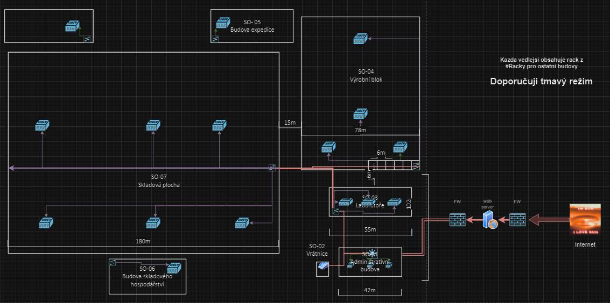
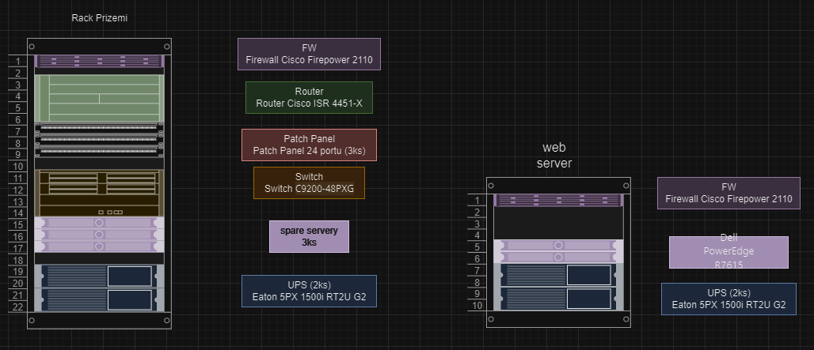

# Projekt Počítačové Sítě

## Přehled
Tento projekt se zaměřuje na návrh a implementaci počítačových sítí pro smyšlenou firmu. Obsahuje detailní schémata síťové infrastruktury a rozpočet na realizaci projektu.

## Obsah
Veškeré soubory naleznete v [Soubory](https://github.com/wrexik/Areal-site/tree/main/soubory)
- `Schemata.drawio.xml`: Obsahuje detailní schémata síťové infrastruktury.
- `rozpočet.xlsx`: Obsahuje podrobný rozpočet na realizaci projektu.
- `Pruvodni_zprava.docx`: Obsahuje popis všeho nového v plánu a podrobný popis jednotlivých částí a budov.

## Požadavky
Pro zobrazení a úpravu souborů se schématy a rozpočtem budete potřebovat následující software:
- [draw.io](https://app.diagrams.net/) nebo jiný kompatibilní nástroj pro diagramy pro soubory `.drawio`.
- Microsoft Excel nebo jiný tabulkový procesor, který podporuje formát `.xlsx`.

## Instalace a použití
1. **Schémata**: 
   - Otevřete soubor `Schemata.drawio.xml` v aplikaci draw.io nebo v kompatibilním nástroji.
   - Prohlédněte si a upravte schémata podle potřeby.

2. **Rozpočet**:
   - Otevřete soubor `rozpočet.xlsx` v Microsoft Excel nebo jiném tabulkovém procesoru.
   - Prohlédněte si a upravte rozpočet podle potřeby.

## Licence
Tento projekt je licencován pod MIT licencí. Další informace naleznete v souboru `LICENSE`.

## Kontakt
Pro více informací nebo otázky ohledně tohoto projektu, kontaktujte mě. Kontakt: [Můj web](https://wrexik.xyz).
